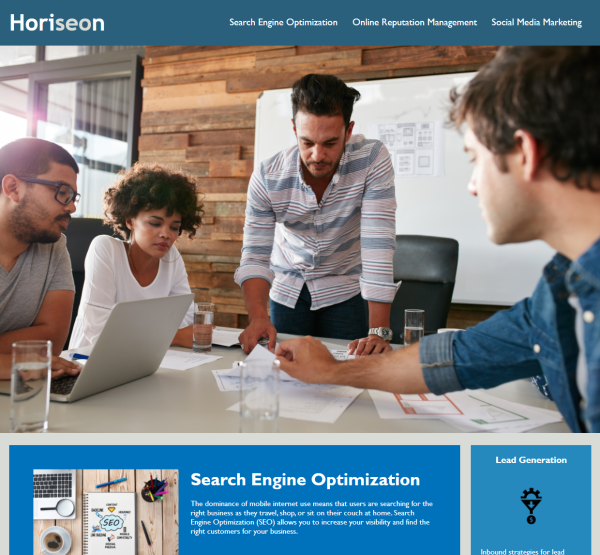

# Horiseon Code Refactoring for Accessibility

## Description

A marketing agency has requested that their website be refactored to follow accessibility standards so that their site is optimized for search engines. Improving a site's accessibility makes it so that people with visual, hearing, or other impairments can more easily navigate and absorb what the website offers. Changes include adding semantic HTML elements, adding alt attributes to all image elements, fixing broken anchor tags, and improving the readability and sustainability of the CSS file with commenting and the DRY principle.

## Table of Contents

- [Installation](#installation)
- [Usage](#usage)
- [Credits](#credits)
- [License](#license)

## Installation

Clone the repository in a CLI using the command `git clone` to download all source files.

## Usage

Upload HTML source code and asset files to hosting service such as GitHub Pages.

The landing page is hosted [here](https://branjames117.github.io/horiseon-accessibility-refactor/).

## Credits

Vanderbilt Coding Boot Camp provided the initial source code to be refactored.

## License

Creative Commons Zero v1.0 Universal
